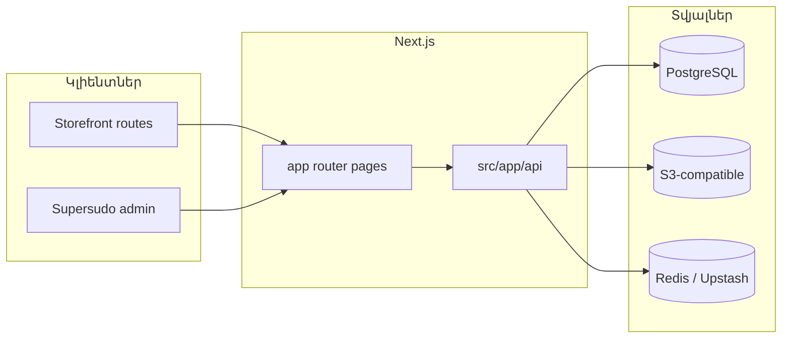

# Նախագծի ճարտարապետություն — Shop Marco

> Ընդհանուր պատկերն ըստ repo-ի կառուցվածքի։ Մանրամասն բիզնես-լոգիկան՝ `docs/BACKEND_ARCHITECTURE.md`։

**Նախագծի չափ (առաջարկ).** B — միջին (monorepo shared packages + մեծ route surface)  
**Վերջին թարմացում.** 2026-04-20

---

## Նշանակություն

Վեբ-կլիենտը (Next.js) և admin UI-ն նույն application codebase-ում են, backend-ը ներկայացված է **Route Handlers**-ով՝ PostgreSQL + Prisma միջոցով։

---

## Բարձր մակարդակի սխեմա



---

## Համակարգի բաղադրիչներ

| Բաղադրիչ | Տեղ | Նշում |
|----------|-----|--------|
| Storefront + հանրային էջեր | `src/app/` | Կատալոգ, cart, checkout, profile, policy, և այլն |
| Admin | `src/app/supersudo/` | Ապրանքներ, պատվերներ, կարգավորումներ |
| REST API | `src/app/api/v1/**` | Contract՝ `docs/API_CONTRACT.md` |
| Դոմեն-լոգիկա | `src/lib/services/`, `src/lib/middleware/` | |
| DB schema / Prisma | `shared/db/prisma/` | Package `@white-shop/db` |
| UI toolkit | `shared/ui/` | `@shop/ui` |
| Design tokens | `shared/design-tokens/` | `@shop/design-tokens` |

---

## Նախագծի կառուցվածք (կարճ)

```
src/
  app/                 # App Router — էջեր, layouts, loading/error, API routes
  components/          # Ընդհանուր UI կոմպոնենտներ
  lib/                 # Սերվիսներ, util-ներ, auth, config
  ...
shared/
  db/                  # Prisma, migrations
  ui/                  # Համօգտագործվող UI
  design-tokens/       # Դիզայն թոքեններ
docs/                  # Այս փաստաթղթերը + API contract
```

---

## Տվյալների հոսք (տիպային)

1. Բրաուզեր → Next.js page (RSC / client component)  
2. տվյալների հարցում → `fetch` / server action → **`/api/v1/...`**  
3. Route handler → validation (zod) → service → Prisma → PostgreSQL  
4. Պատասխան JSON → client

---

## Անվտանգություն (ակնարկ)

- JWT Bearer (`docs/API_CONTRACT.md`)  
- Admin routes — role check  
- Մանրամասներ՝ `.cursor/rules/08-security.mdc`, env՝ `.env.example`

---

## Կապված փաստաթղթեր

- [`BRIEF.md`](./BRIEF.md)  
- [`TECH_CARD.md`](./TECH_CARD.md)  
- [`API_CONTRACT.md`](./API_CONTRACT.md)  
- [`BACKEND_ARCHITECTURE.md`](./BACKEND_ARCHITECTURE.md)  
- [`PROGRESS.md`](./PROGRESS.md)
