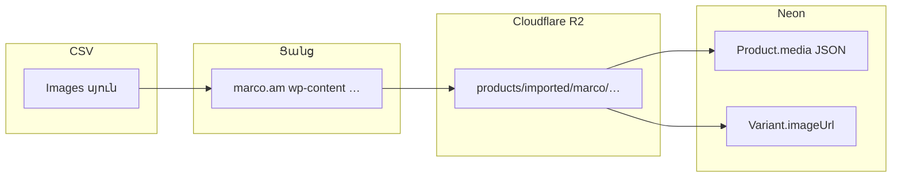

# Marco Sheet1 CSV — թիմի ուղեցույց (կատալոգ, ֆիլտրեր, նկարներ)

Այս փաստաթուղթը **Telegram / WooCommerce export** `Marco - Sheet1.csv` ֆայլի համար է՝ նույն աղյուսակում ապրանքների, ֆիլտրերի և նկարների հոսքը մեկ տեղում հասկանալի դարձնելու համար։

---

## 1. Թվեր (ներկա ֆայլը)

| Չափանիշ | Արժեք |
|--------|--------|
| Ապրանքների տողեր (parsed) | **35** (ոչ 40 — Excel-ում տողերի քանակը կարող է տարբերվել դատարկ տողերից) |
| `Filter1`…`Filter23` սյուներ | **23** (ատրիբուտի սահմանում CSV վերնագրից) |
| Լոկալներ DB-ում | `hy`, `en`, `ru` |

Ստուգման հրաման (DB/R2 չի բացում).

```powershell
cd d:\marco
node scripts/count-marco-csv-rows.cjs "C:\Users\ROG\Downloads\Telegram Desktop\Marco - Sheet1.csv"
```

---

## 2. Ներմուծում Neon + R2

Պահանջվում են `DATABASE_URL` և R2 փոփոխականները (տե՛ս `.env.example`)։

```powershell
cd d:\marco
node scripts/import-marco-csv-products.cjs "C:\Users\ROG\Downloads\Telegram Desktop\Marco - Sheet1.csv"
```

Արդեն ներմուծված տողերը թարմացնելու համար.

```powershell
$env:IMPORT_UPDATE_EXISTING="1"
node scripts/import-marco-csv-products.cjs "C:\Users\ROG\Downloads\Telegram Desktop\Marco - Sheet1.csv"
```

- **Վարիանտի SKU**՝ `MARCO-{CSV ID}` (օր. `MARCO-11247`)։
- **Նկարներ**՝ `Images` դաշտի `https://...` URL-ները ներբեռնվում են, վերբեռնվում **R2** `products/imported/marco/{ID}-…` բանալիով, DB `media` և վարիանտի `imageUrl` պահում են R2 հասցեն։
- **Ֆիլտրեր**՝ յուրաքանչյուր լցված `Filter{N} - …` բջիջ ստեղծում/կապում է `Attribute` (`marco_filter_{N}`), `AttributeValue`, `ProductAttribute`, `ProductVariantOption` և վարիանտի `attributes` JSON (նույն ձևաչափով, ինչ admin-ում)։

### 2.1. Ո՞ր սկրիպտն օգտագործել

| Սկրիպտ | Նկարագրություն |
|--------|----------------|
| `scripts/import-marco-csv-products.cjs` | **Ամբողջական** Sheet1 — կատեգորիաներ, բրենդ, գույն, **բոլոր Filter\*** ատրիբուտները, նկարներ R2։ **Օգտագործի՛ր սա։** |
| `pnpm` / `src/scripts/import-marco-csv-products.ts` | Այլ հոսք; Sheet1-ի բոլոր Filter սյուները **չեն** համընկնում այստեղի լոգիկայի հետ։ |

---

## 3. Սյուների խմբավորում — աշխատանքի հերթականություն

| # | Խումբ | Սյուներ | Ինչ է լինում DB-ում |
|---|--------|---------|---------------------|
| 1 | Նույնացուցիչ | `ID`, `Name`, `SKU` | `ID` + `Name` պարտադիր; SKU արտադրանքում՝ `MARCO-{ID}` |
| 2 | Գներ | `price`, `Sale price` | Վաճառքի գին՝ `Sale price` եթե կա, այլապես `price`; `compareAtPrice` եթե կանոնավոր գինը ավելի մեծ է |
| 3 | Տեքստ | `Short description`, `Description` | `subtitle` / `descriptionHtml` (HTML պահվում է) |
| 4 | Դասակարգում | `Category`, `Brand`, `Color` | Կատեգորիայի ծառ `>` բաժանիչով, բազմակի ուղիներ՝ ստորակետով; `Color` → ատրիբուտ `color` |
| 5 | Ֆիլտրեր | `Filter1 - …` … `Filter23 - …` | Տե՛ս բաժին 4 |
| 6 | Նկարներ | `Images` | Մի քանի URL՝ ստորակետով, միայն `http(s)://` |

---

## 4. Ֆիլտրեր → Prisma ատրիբուտներ

### 4.1. CSV վերնագիր

Ձևաչափ՝ **`Filter{N} - {Անվանում}`** (թույլատրվում են բացեր `Filter` և թիվի միջև, օր. `Filter3- Վանդակ…`)։

### 4.2. DB բանալի և անուն

| CSV | `Attribute.key` | Ցուցադրական անուն (translations) |
|-----|-----------------|----------------------------------|
| `Filter1 - Մակերեսը (Գազ/էլ)` | `marco_filter_1` | «Մակերեսը (Գազ/էլ)» (գծիկից հետո տեքստը) |
| `Filter10 - …` | `marco_filter_10` | … |

Դատարկ բջիջը նշանակում է՝ այդ ապրանքի համար տվյալ ֆիլտրը **չի** կցվում։

### 4.3. Գույն vs Filter

- **`Color`** — առանձին ատրիբուտ `color` (ընտրության/վարիանտի գույն)։
- **`Filter*`** — տեխնիկական/կատեգորիական ֆիլտրեր (մակերես, ծածկույթ, տարողություն և այլն)։

### 4.4. Կայքի ցուցադրում (կարևոր)

- **Ապրանքի էջ (PDP)**՝ `productAttributes` + վարիանտի `options` տվյալները կարող են օգտագործվել ատրիբուտների ընտրիչում/մետատվյալներում (`build-attribute-groups-new` և կապակցված կոմպոնենտներ)։
- **Ապրանքների ցանկ (PLP) ֆիլտրերի API** (`products-filters.service`) ներկայումս հիմնականում հավաքում է **գույն և չափ** վարիանտների տվյալներից. `marco_filter_*`-ը **ավտոմատ side-filter չեն** դառնում մինչև առանձին UI/API ընդլայնում։ Ներմուծումը նախապատրաստում է տվյալների շերտը՝ հետագա ֆիլտրերի համար։

---

## 5. Նկարների հոսք (R2)



1. Parser-ը բաց է թողնում ոչ-HTTP հղումները։
2. R2 կարգավորված լինելու դեպքում՝ ներբեռնում + `PutObject`, հանրային URL `R2_PUBLIC_URL`։
3. R2 չլինելու դեպքում՝ պահվում է սկզբնական URL (production-ում խորհուրդ է տրվում R2)։

---

## 6. Excel / Google Sheets աշխատանք

- **`Description`** դաշտը հաճախ բազմատող է (HTML + `\n`). Չխզել CSV-ի չակորդների կառուցվածքը։
- Նոր ֆիլտր ավելացնելիս պահել **`Filter{N} - {Անվանում}`** ձևաչափը, որպեսզի `marco_filter_{N}` կանոնավոր մնա։
- **Նկարներ**՝ մի URL-ից ավելին՝ ստորակետով, առանց բացատների «կպած» միացումների, եթե հնարավոր է։

---

## 7. Կապակցված սկրիպտներ

| Ֆայլ | Նպատակ |
|------|--------|
| `scripts/import-marco-csv-products.cjs` | Ներմուծում |
| `scripts/count-marco-csv-rows.cjs` | Տողերի և Filter սյուների հաշվարկ |
| `scripts/delete-all-products-neon-r2.cjs` | Միայն ապրանքների մաքրում Neon + R2 `products/` և `product-import/` |

---

**Տարբերակ.** Փաստաթուղթը համաձայնեցված է `import-marco-csv-products.cjs` ֆիլտրերի ներմուծման հետ (Sheet1 + Filter\* + R2)։
